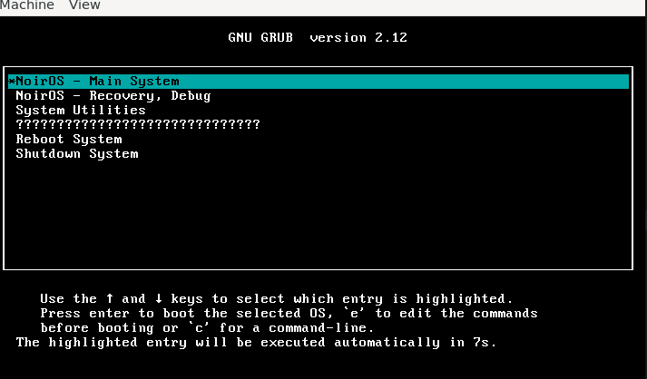
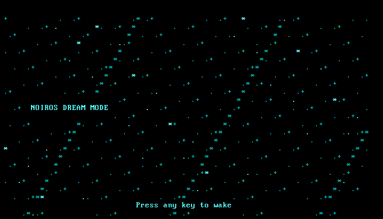
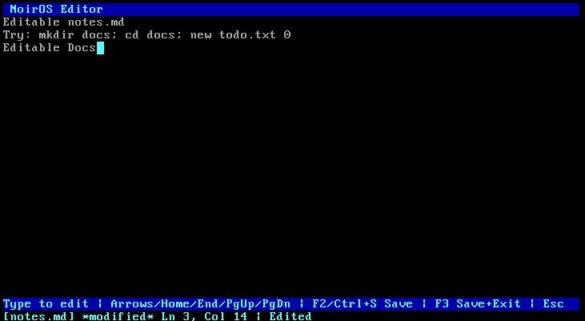
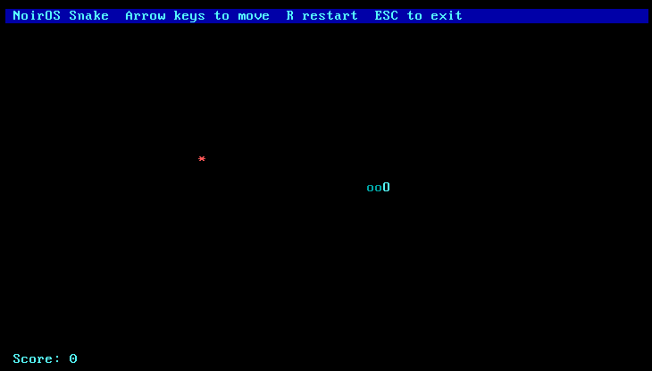

# NoirOS

<span style="color:#00BCD4;"><strong>Noir</strong></span> <span style="color:#F44336;"><strong>OS</strong></span> is a lightweight hobby operating system for x86 (32-bit), focused on a fast text-mode desktop, shell tools, and small built-in apps/games.

-607D8B)


## Highlights

- Boot splash loader with Noir OS logo (cyan/red) before desktop
- Multi-panel file browser + viewer UI
- Persistent command panel (run many commands without reopening)
- Built-in text editor, calculator, and command history
- Built-in games: snake, pong, dodge, catch
- Restart, shutdown, and sleep power screens

## Color-Coded Feature Areas


## Command Reference

### Navigation and Info

- `help`, `man`
- `ls`, `ll`, `dir`
- `cd <dir>|..|/`
- `pwd`
- `info`, `uname`, `whoami`
- `history`

### File and Directory Operations

- `mkdir <name>`
- `rmdir <name>`
- `touch <file>`
- `new <name> <type>` where type is `0=text`, `1=exe`, `2=game`
- `cat <file>`
- `edit <file>`
- `cp <source> <dest>`
- `mv <source> <dest>`
- `rm <name>`, `del <name>`

### Utilities

- `calc <expr>`
- `echo <text>`
- `clear`, `cls`

### Apps and Games

- `run <file.nc>` for NoirC files
- `snake`
- `pong`
- `dodge`
- `catch`

### Session and Power

- `exit`, `quit`
- `restart`, `reboot`

## Screenshots






## Build and Run

See [BUILD.md](BUILD.md) for full setup instructions.

### Quick Build (WSL)

```bash
wsl bash build.sh
```

### Quick Run

```bash
make NoirOS.iso
make run
```

## Project Structure

```text
/NoirOS
|- boot/
|- docs/
|- include/
|- src/
|- assets/
|- Images/
|- BUILD.md
|- Makefile
`- Readme.md
```

## License

This project is licensed under the MIT License.
